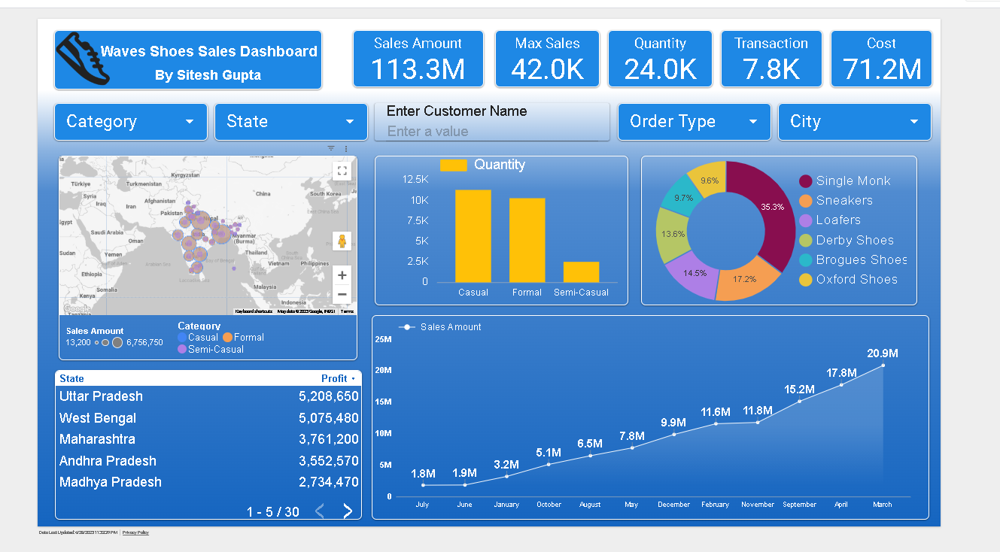

# 📊Waves Shoes Sales Dashboard

https://github.com/user-attachments/assets/71bc73e9-418f-49d7-bb11-050279fbcccf

## Project Overview:
This interactive sales dashboard provides a comprehensive overview of the Waves Shoes performance across different states, categories, and shoe types. Built using Looker Studio, the dashboard helps decision-makers quickly understand key business metrics and drive data-informed decisions.
__________________________________________________________________________________________________

🚀**Dashboard Preview:**
<p align="left">  </p>

__________________________________________________________________________________________________

📂**Project Structure:**
```
Waves-Shoes-Sales-Dashboard/
│
├── README.md                   # Project overview and instructions
├── project_info.txt             # Detailed project description
├── dashboard_preview.png        # Screenshot of Looker Studio dashboard
├── data_source_description.txt  # Dataset explanation
├── Link.txt                     # Live Looker dashboard link
```
__________________________________________________________________________________________________

🛠️**Tools Used:**
- Google Looker Studio - Dashboard creation and visualization.
- Google Sheets - Data management
- Data Cleaning & Modeling prior to dashboard design
__________________________________________________________________________________________________
🚀**How to View the Dashboard:**
If you want to explore the dashboard live:
- **[https://lookerstudio.google.com/u/1/reporting/1d0ee02d-4973-4b8e-a52d-b2ccb9c1f072/page/TlxGF]**  
- Open the **Dashboard_Preview.png** to view the dashboard.
- Check Link.txt for the live Looker Studio dashboard.
__________________________________________________________________________________________________
📈**Key Insights from Dashboard:**
- Total Sales Overview:
   - Sales Amount: 113.3M
   - Max Sales (Single Transaction): 42.0K
   - Total Quantity Sold: 24.0K
   - Total Transactions: 7.8K
   - Total Cost: 71.2M

- Dynamic Filters: Users can filter data by:
    - Category
    - State
    - Order Type
    - City
    - Customer Name

- Geo Map Visualization:
     - Displays regional sales performance across India.
     - Color-coded by shoe categories (Casual, Formal, Semi-Casual).

- Top States by Profit:
Highlights leading states such as:
  - Uttar Pradesh – ₹5.2M profit
  - West Bengal – ₹5.07M
  - Maharashtra – ₹3.76M

- Category-wise Quantity Sold:
Casual shoes dominate the volume, followed by Formal and Semi-Casual.

- Shoe Type Distribution:
Pie chart showing the share of various shoe styles, with Single Monk leading at 35.3%.
__________________________________________________________________________________________________
** Sales Trend Over Time:**
  - Line chart showing month-over-month growth.
  - Peak in March with ₹20.9M in sales.
_________________________________________________________________________________________________
